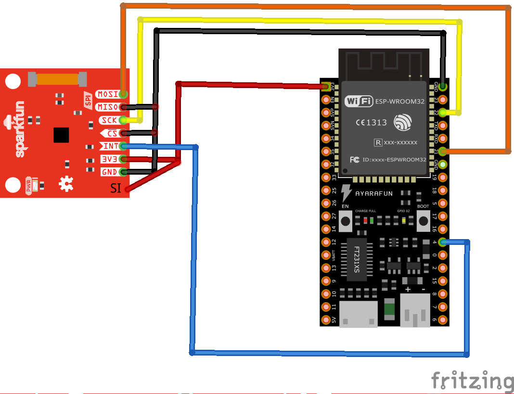
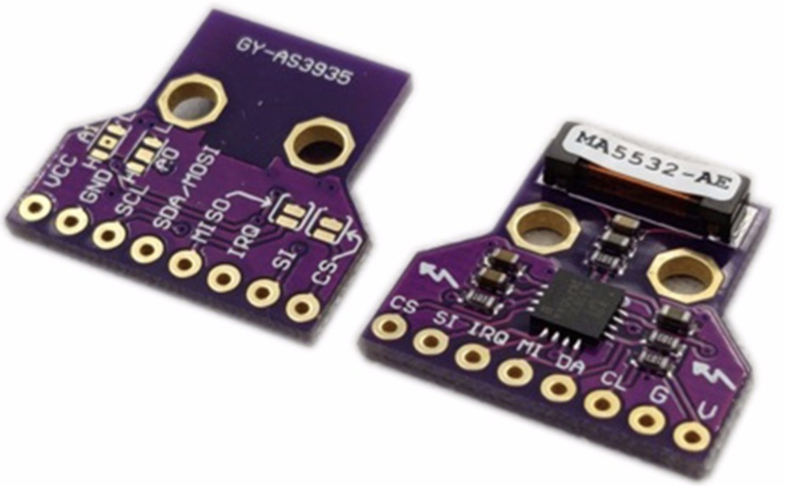

# AS3935 lightning sensor with an ESP32

### Introduction

This project is for testing purpose and provides a working example for the lightning sensor "AS3935" with an ESP32.

### Usage

Just compile and upload the ".ino" file to the board and connect the sensor as shown below.

### Schematic

### Sensor

 
### Components
* [AS3935](https://www.mdpi.com/2079-9292/8/12/1512)
* [ESP32 development board](https://www.espressif.com/en/products/devkits)
* [Arduino](https://www.arduino.cc) 