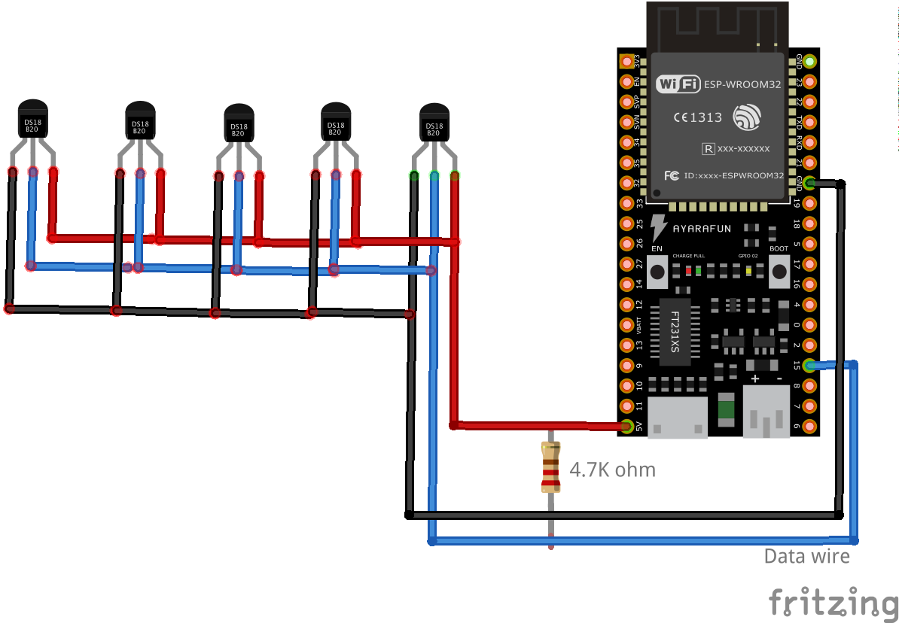

# Temperature sensor DS18B20 with ESP32 from TTGO

### Introduction

This project is for testing purpose and provides a working example to measure the temperature by using a DS18B20 temperature sensor which works via the Dallas’ 1-Wire bus. Several sensors are able to use the same wire for communication. See the schematic below.

### Usage

Just compile and upload the ".ino" file to the board, connect the sensors and very important the 4.7K Ohm resistor as stated below. 

### Schematic

 
### Components
* [DS18B20](https://datasheets.maximintegrated.com/en/ds/DS18B20.pdf)
* [ESP32 development board](https://www.espressif.com/en/products/devkits)
* [Arduino](https://www.arduino.cc) 
* [Research on 1-Wire Bus Temperature Monitoring System](https://ieeexplore.ieee.org/abstract/document/4351019)