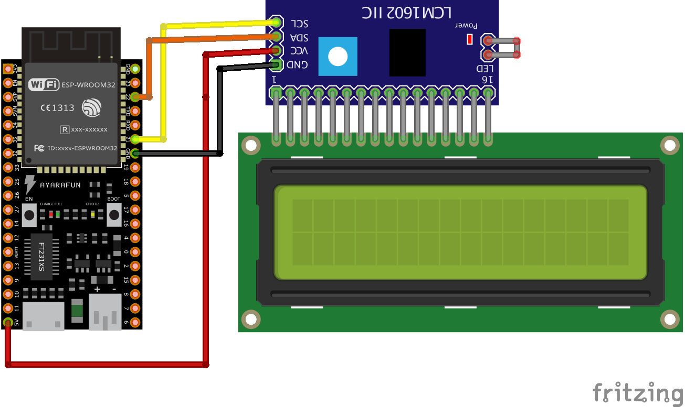
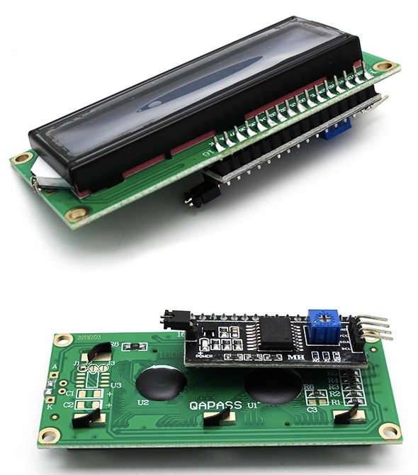

# LCD1602 16x2 with an ESP32 example

### Introduction

This project is for testing purpose and provides a working example for the display "LCD 1602" with an I2C Serial Interface Adapter Module.

### Usage

Just compile and upload the ".ino" file to the board and connect the display as shown below.

### Schematic

### LCD

 
### Components
* [LCD1602](https://www.instructables.com/How-to-Connect-I2C-Lcd-Display-to-Arduino-Uno/)
* [ESP32 development board](https://www.espressif.com/en/products/devkits)
* [Arduino](https://www.arduino.cc) 