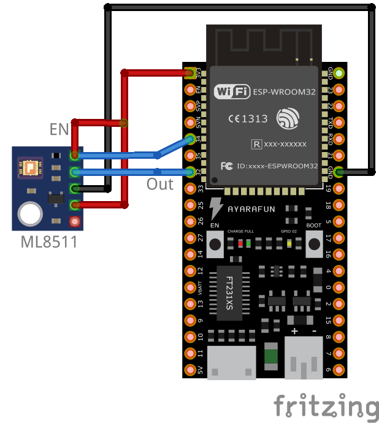

# Noise detection with KY-037 and the ESP32 in Arduino

## Introduction

This project is for testing purpose and provides a working example to read out the UV intensity with the sensor ML8511. This sensor detects 280-390nm light most effectively which is categorised the UVB and most of the UVA spectrum. Do only use this sensor and project as an example. I do not guarantee correct readings, please protect yourself from the sun.

### Usage

Just compile and upload the ".ino" file to the board, connect the sensor as shown below and the data will be shown in the serial terminal. 

### Schematic

 
### Components
* [ML8511](http://journal2.um.ac.id/index.php/jodli/article/view/17091)
* [ESP32 development board](https://www.espressif.com/en/products/devkits)
* [Arduino](https://www.arduino.cc) 

