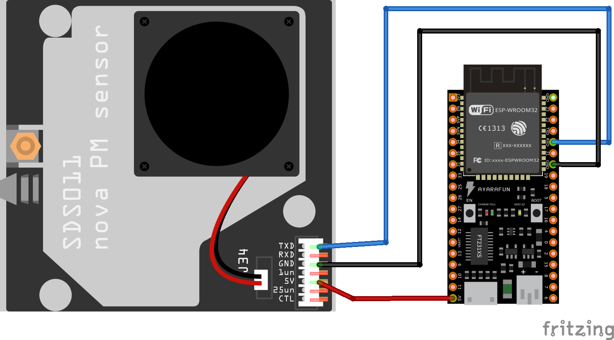

# SDS011 particle sensor with ESP32 in Arduino

## Introduction

This project is for testing purpose and provides a working example to read out the fine dust sensor SDS011. This sensor measures PM 2.5 and PM 10 air particle count in μg/m3. 

### Usage

Just compile and upload the ".ino" file to the board, connect the sensor as shown below and the data shall be shown in the serial terminal.

### Schematic

 
### Components
* [SDS011](https://www.researchgate.net/profile/Achim_Dittler/publication/329809390_Potential_and_Limitations_of_the_Low-Cost_SDS011_Particle_Sensor_for_Monitoring_Urban_Air_Quality/links/5c2745bc299bf12be3a05133/Potential-and-Limitations-of-the-Low-Cost-SDS011-Particle-Sensor-for-Monitoring-Urban-Air-Quality.pdf)
* [ESP32 development board](https://www.espressif.com/en/products/devkits)
* [Arduino](https://www.arduino.cc) 

