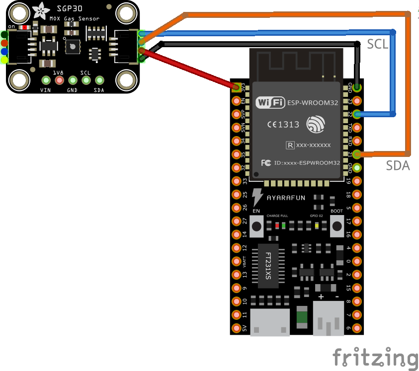

# SGP30 (TVOC) sensor with ESP32 

### Introduction

This project is for testing purpose and provides a working example to measure the total volatile organic compounds (TVOC).

### Usage

Just compile and upload the ".ino" file to the board and connect the sensors as shown below.

### Schematic

 
### Components
* [SGP30](https://www.sensirion.com/en/environmental-sensors/gas-sensors/sgp30/)
* [ESP32 development board](https://www.espressif.com/en/products/devkits)
* [Arduino](https://www.arduino.cc) 