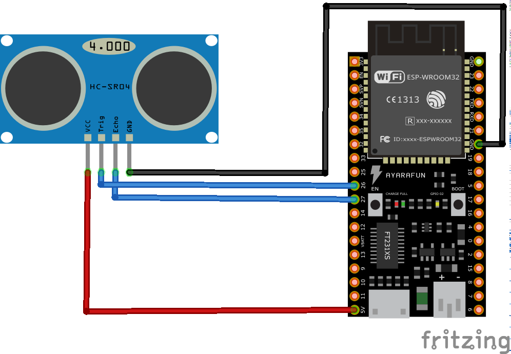

# Ultrasonic distance measuring with HC-SR04 and the ESP32 in Arduino

## Introduction

This project is for testing purpose and provides a working example to measure the distance in cm with an ultrasonic sensor.

### Usage

Just compile and upload the ".ino" file to the board, connect the sensor as shown below and the distance will be be printed in the serial terminal. 

### Schematic

 
### Components
* [HC-SR04](https://centmesh.csc.ncsu.edu/ff_drone_f14_finals/Sensor1/files/hcsr04.pdf)
* [ESP32 development board](https://www.espressif.com/en/products/devkits)
* [Arduino](https://www.arduino.cc) 

