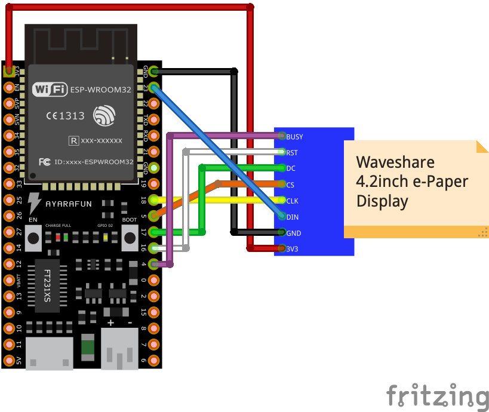
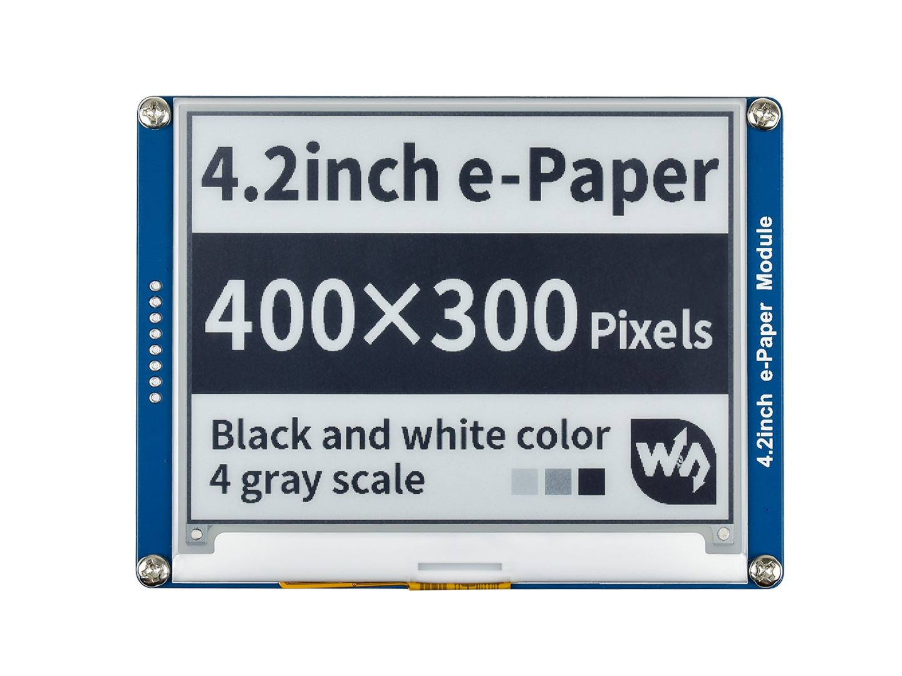
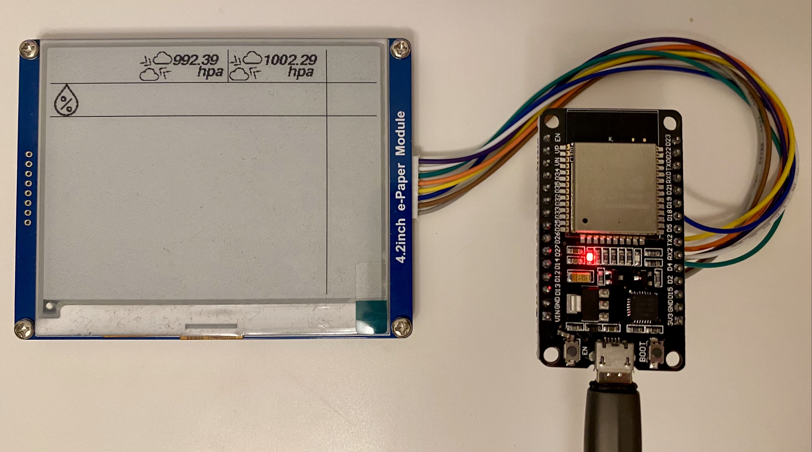

# Waveshare 4.2inch e-Paper display with ESP32 in Arduino

### Introduction

This project is for testing purpose and provides a working example to display pre-created icons with sensor measurements on the Waveshare 4.2inch e-Paper display.

### Usage

Just compile and upload the ".ino" file to the board, connect the display as stated below and the display will show the example project as show in the demo below. 

#### Transform a image into C code

I used the website [image2cpp](https://javl.github.io/image2cpp/) to transform an image into a byte array which can be used in the C++ code. Just upload a picture and copy the resulting byte code into "icons.h".

### Schematic

### Used display

### Demo

 
### Components
* [Waveshare 4.2inch e-Paper](https://www.waveshare.com/wiki/4.2inch_e-Paper_Module)
* [ESP32 development board](https://www.espressif.com/en/products/devkits)
* [Arduino](https://www.arduino.cc) 
* [Fonts](https://learn.adafruit.com/adafruit-gfx-graphics-library/using-fonts)
* [Draw library](https://learn.adafruit.com/adafruit-gfx-graphics-library/graphics-primitives)
* [Free clima icons](https://github.com/christiannaths/Climacons-Font)
* [Free weather icons](https://www.alessioatzeni.com/meteocons/)

