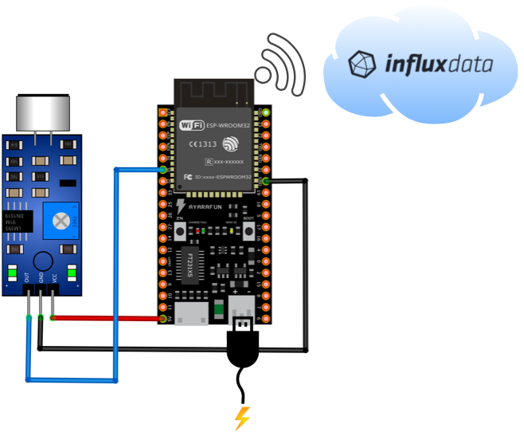
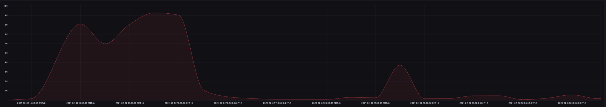

# Noise detection with KY-037 and the ESP32 in Arduino with InfluxDB

## Introduction

This project is for testing purpose and provides a working example to read out the binary noise detection of the noise detection sensor KY-037. The code is using an interrupt and prints the counted noise hits every 15 seconds onto the serial console. Furthermore it sends the data to InfluxDB locally or to InfluxDB cloud depending on the setting. The stored sensor data can be visualised over time using InfluxDB dashboards (see the result section).
 
### Usage

Just enter your personal credentials in the "AACredentials.h" file, compile and upload the ".ino" file to the board, connect the sensor as shown below and the data will be shown in the serial terminal and send to InfluxDB. Some KY-037 boards also have an analog output but this will not be used in this example.

#### Fine tuning the sensor
After connecting the pins of the sensor as shown below and connect the ESP32 development board to power. You should see the right (power) LED from the noise sensor lit up. The left LED (L2) is depending on the resistor setting is also on or off.

My advise is to go to a quiet room and adjust the resistor to a value where the LED L2 just goes off. This sets the sensitive of the sensor to your current noise level which is "quite". 

Now you shall see higher counts when noise is higher and a count of 0 when it is quiet.

### Schematic

 
### Components
* [KY-037](https://create.arduino.cc/projecthub/electropeak/how-to-use-ky-037-sound-detection-sensor-with-arduino-a757a7)
* [ESP32 development board](https://www.espressif.com/en/products/devkits)
* [Arduino](https://www.arduino.cc) 
* [InfluxDB](https://www.influxdata.com/blog/influxdb-2-0-open-source-is-generally-available/)

### Result

The below graph shows the noise levels over 11 hours.

### Links

* [Install InfluxDB](https://docs.influxdata.com/influxdb/v2.0/get-started/)
* [Influx Cloud (Optional)](https://www.influxdata.com/products/influxdb-cloud)
* [Install 64bit OS on the Raspberry Pi](https://medium.com/for-linux-users/how-to-make-your-raspberry-pi-4-faster-with-a-64-bit-kernel-77028c47d653)
* [Configure Influx as a service on the Raspberry Pi](http://blog.lemminger.eu/run-influxdb-2-0-as-a-service/)

